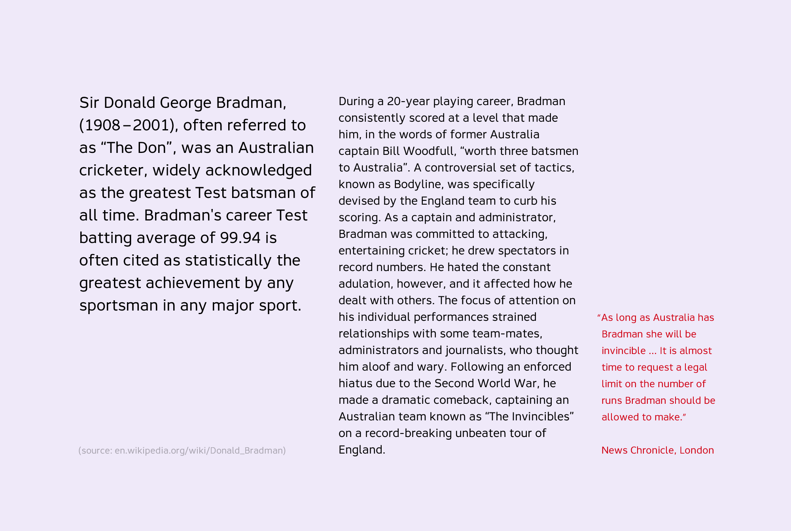

# Resultat Typeface

Resultat is a mechanical sans-serif typeface with a humanistic touch that I made as a part of my thesis in 2012. I designed it to be used as a body typeface and it has a basic latin language support. It’s designed with screens and handheld devices in mind, but it works equally well in print.

Resultat was made in 2012 as a part of my bachelors [thesis](https://www.theseus.fi/bitstream/handle/10024/41818/examensarbete_mathias_lindholm.pdf?sequence=1) at Arcada University of Applied Sciences. Special thanks to Christoffer Leka, Jutta Törnqvist and Saku Heinänen.

- [Download project source](https://github.com/mlindholm/resultat/archive/master.zip)
- [PDF specimen](specimen/Resultat-Specimen.pdf)
- [Web specimen](https://thisismatu.github.io/resultat/)

## Specimen

## License

This Font Software is licensed under the SIL Open Font License, Version 1.1. 
This license is copied below, and is also available with a FAQ at 
http://scripts.sil.org/OFL
